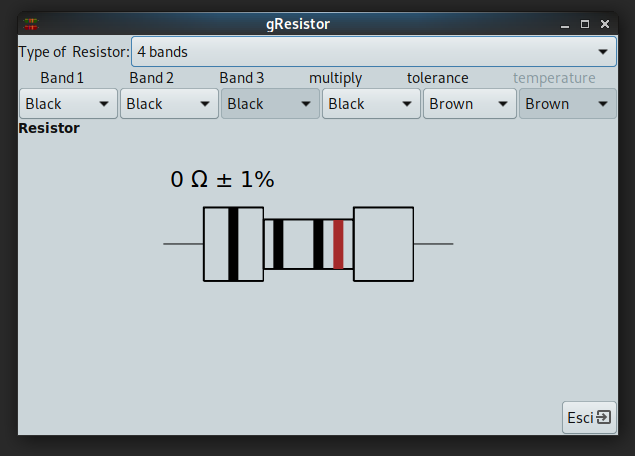
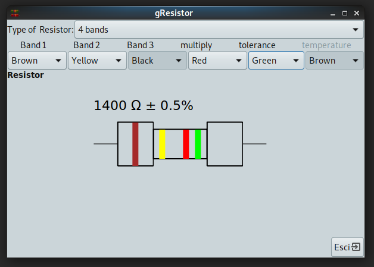

# GResistor

To allow for identification, resistors are usually marked
with colored bands. Often refered to as color codes, these
markings are indicative of their resistance, tolerance and
temperature coefficient. gResistor helps you translate
resistor color codes into a readable value. All you have to
do is watch the colors on the resistor and then enter them
in the program. As you enter colours you'll see that the
resistor value is changing accordingly.





## Installation

gResistor uses Python distutils for installation.

To install gResistor you'll need to have root privileges to make this install.

```
python setup.py install

# or 

sudo python setup.py install
```

In a terminal.

## Run the program

To run the program just type 'gresistor.py' or click the icon in 'Applications>Accesories>gResistor'

## Reference

This is based on the application developed by 'Pop Gheorghe' <pop.gheorghe@rdslink.ro> and downloaded from [sourceforge](https://sourceforge.net/projects/gresistor/) 


Resistor color codes are explained 
 *  [Electronic color code](https://en.wikipedia.org/wiki/Electronic_color_code#Resistor_code)
 * [arrow.com](https://www.arrow.com/en/research-and-events/articles/resistor-color-code)

Many information, such description and desktop files came from the [old debian
package](http://archive.ubuntu.com/ubuntu/pool/universe/g/gresistor/gresistor_0.0.1-0ubuntu3_all.deb)
