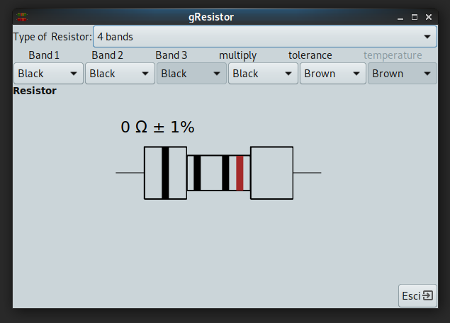
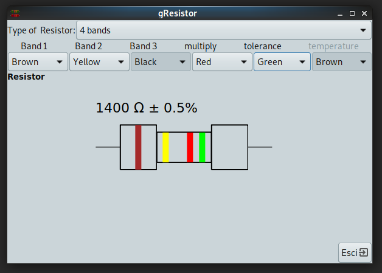

To allow for identification, resistors are usually marked
with colored bands. Often refered to as color codes, these
markings are indicative of their resistance, tolerance and
temperature coefficient. gResistor helps you translate
resistor color codes into a readable value. All you have to
do is watch the colors on the resistor and then enter them
in the program. As you enter colours you'll see that the
resistor value is changing accordingly.






## Installation

### Flatpak

The application landed on [flathub](https://flathub.org/apps/details/eu.stethewwolf.gresistor), now you can install using :

```
$ flatpak install flathub eu.stethewwolf.gresistor

```

And then you can run : 


```
flatpak run eu.stethewwolf.gresistor

```

### Pypi

You can install gResistor using the command :
```
$ pip install gResistor
```

### Source Code
If you want, you can clone the git repo and run directly the setup.py script on your machine:

```
$ git clone https://github.com/stethewwolf/gResistor.git

$ cd gresistor

$ python setup.py install

```

## Run the program

To run the program just:
  * type `gresistor3`
  * click the icon in 'Applications>Accesories>gResistor'

## Report an Issue

Pleas if you find an error or if you want to propose something new, please visit this [page](https://github.com/stethewwolf/gResistor/issues)


## References

This is based on the application developed by 'Pop Gheorghe' <pop.gheorghe@rdslink.ro> and downloaded from [sourceforge](https://sourceforge.net/projects/gresistor/)

Resistor color codes are explained:

 * [Electronic color code](https://en.wikipedia.org/wiki/Electronic_color_code#Resistor_code)
 * [arrow.com](https://www.arrow.com/en/research-and-events/articles/resistor-color-code)

Many information, such description and desktop files came from the [old debian
package](http://archive.ubuntu.com/ubuntu/pool/universe/g/gresistor/gresistor_0.0.1-0ubuntu3_all.deb)

List of the colors code got from [here](https://www.rapidtables.com/web/color/RGB_Color.html)

This project is hosted on [GitHub](https://github.com/stethewwolf/gResistor)
